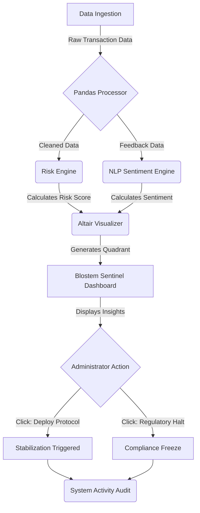

# Blostem-Sentinel-Sovereign-AI
AI driven fintech risk management model for Sovereign banking infrastructure

Link to working MVP-
https://blosten-sentinel.streamlit.app/

**📖 Project Overview-**

Blostem Sentinel is a specialized risk-monitoring engine designed to stabilize institutional banking ecosystems. It utilizes Sentiment Analysis and Multidimensional Risk Mapping to identify "Flight Risk" accounts and stabilize them through automated institutional protocols.

**🛠️ Tech Stack**

Language: Python 3.10+

Interface: Streamlit (Web Dashboard)

Data Logic: Pandas & NumPy

AI/NLP: TextBlob (Sentiment Scoring)

Visualization: Altair (Strategic Risk Quadrants)

## 🔄 System Architecture Flow

 
 **🎛️System Control Panel (The Left Sidebar)-**
 
The sidebar acts as the "Simulation Engine", allowing administrators to manipulate global variables to see how they impact institutional risk.

**Dataset Configuration:** This section allows the user to upload data from different banking sectors or regions.

**Risk Threshold Sliders:** Administrators can manually adjust the "Risk Sensitivity" (e.g.- setting the threshold at 54%).

The Impact: Moving this slider instantly re-plots the Strategic Risk Mapping quadrant, highlighting more (or fewer) accounts as "Flight Risks" based on current institutional tolerance.

**Scale Controls:** Includes toggles for Linear vs. Logarithmic views.

The Logic:In high-variance financial data, logarithmic scales help in identifying micro-trends in massive datasets that would otherwise be hidden in a standard linear view.

📊 **Dashboard Intelligence: Feature Breakdown**

This dashboard serves as the command center for sovereign risk monitoring. Here is how the system processes data:

**1) Strategic Risk Mapping (The Quadrant)**
The central visualization uses a Risk vs. Value (Predicted LTV) matrix.

The Logic: By plotting accounts on this grid, the AI identifies high-value assets that are drifting into high-risk zones (the top-right quadrant).

Categories: It automatically segments users into Financial, Technical, or General Service risks, allowing for targeted institutional intervention.

****2) AI Rationale Engine****-
On the right sidebar, the system provides a Transparency Layer.

Model Confidence: Displays a real-time confidence score (e.g., 97.3%) for each risk prediction.

Variable Impact: A bar chart visualizes which factors—such as Market Sentiment, LTV Drop, or Service Usage—are driving the **risk alert**.

**3) Action Engine & Audit Trail**

The "Deploy Protocol" Button: Allows administrators to execute stabilization measures with a single click.

System Activity Audit: A live ledger at the bottom records every action taken (e.g., "ID-1041 resolved via stabilization protocol") ensuring full **regulatory compliance and accountability.**

The Blostem Sentinel Solution: Reactive vs. Proactive Risk ManagementFeature

Traditional Approach (Reactive)                        
Blostem Sentinel (Proactive)

Problem IdentificationManual 
slow review of financial reports
Instant Detection: AI-driven text analysis identifies sentiment drops and "Flight Risks" in real-time

Institutional Action
Delayed compliance audits and manual account freezes
Automated Protocols: One-click deployment of stabilized protocols or regulatory compliance halts

Visual Impact
No unified "map" of systemic risk
Strategic Clarity: The Risk Mapping quadrant provides instant visibility into which assets are stabilized vs. which are at-risk

Real-World Result
Potential capital flight and systemic instability
Sovereign Result: Verified stabilization of assets, protecting national banking liquidity.

